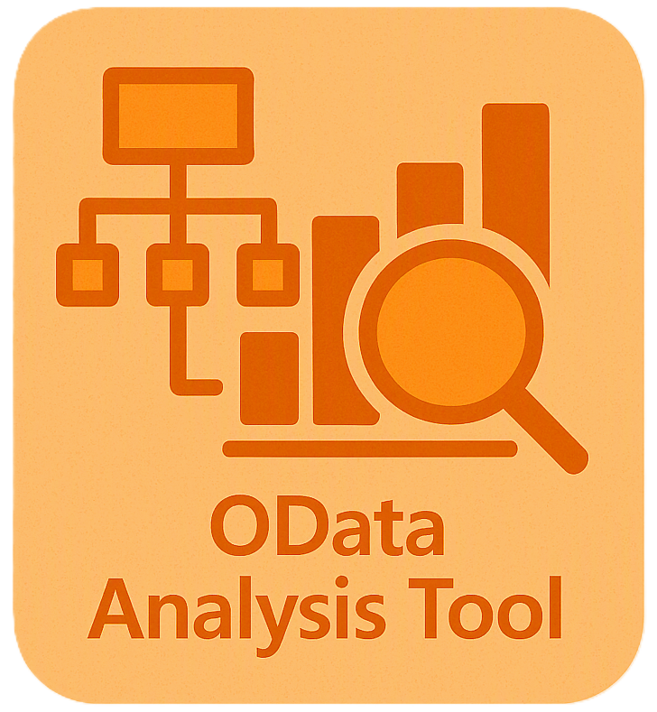

# 🟠 OData Analysis Tool

<p align="center">
  
</p>

<p align="center">
  <strong>A Blazor Server application for analyzing, exploring, and generating OData requests for Dynamics 365 Finance & Operations.</strong>
</p>

---

## ✨ Features

| Feature | Description |
|---------|-------------|
| **Metadata Fetching** | Load OData `$metadata` from any F&O environment URL — automatically appends `/data/$metadata` |
| **Entity Explorer** | Browse all Entity Sets and Entity Types with search, filter, and virtualized scrolling |
| **Property Inspection** | View all properties with type, nullable, required, editable, and enum indicators |
| **Relationship Mapping** | Inspect navigation properties, referential constraints, and relationship types |
| **Enum Support** | View all enum types and their members; constrained dropdowns ensure valid values only |
| **Version Comparison** | Side-by-side comparison of versioned entities (e.g., `Projects` vs `ProjectsV2`) |
| **Query Helper** | Generate copy-pasteable OData requests (GET, POST, PATCH, DELETE) with filters, keys, and body |
| **State Persistence** | Loaded metadata persists across page navigation within the same session |

---

## 🚀 Getting Started

### Prerequisites

- [.NET 10 SDK](https://dotnet.microsoft.com/download/dotnet/10.0)
- Visual Studio 2026+ or any IDE with .NET support

### Run Locally

```bash
# Clone the repository
git clone https://github.com/ZurenoC/ODataMapper.git
cd ODataMapper/ODataMapper

# Run the application
dotnet run
```

The app will be available at `https://localhost:5001` (or the port shown in the terminal).

### Usage

1. **Enter your F&O URL** on the Home page (e.g., `https://your-env.operations.dynamics.com`)
2. Click **Load Metadata** — the tool fetches and parses the OData metadata document
3. **Search & filter** the entity list to find what you need
4. Click **Details** to inspect properties, relationships, and enum types
5. Use **Compare** to view differences between entity versions
6. Open **Query Helper** to generate ready-to-use OData requests

---

## 📖 Pages

### Home
The main landing page. Load metadata from any F&O environment and browse all entities with stats cards showing Entity Sets, Entity Types, Enum Types, and Versioned Entities.

### Entity Detail
Deep dive into a single entity: view all properties (with data types, required/editable flags), navigation properties with referential constraints, and enum member lists.

### Compare
Select two entities side-by-side to compare their properties, relationships, and enum definitions. Uses searchable dropdowns for quick entity selection.

### Query Helper
Build OData requests interactively:
- **GET** — Add filters, `$top`, `$skip`, `$select`, `$orderby`, and cross-company
- **POST** — Build JSON body with required/editable fields; enum fields use constrained dropdowns
- **PATCH** — Key values with full enum path formatting (e.g., `EnumType'Value'`)
- **DELETE** — Key-based URL generation

Copy the generated request to clipboard for use in Postman, Power Automate, or custom code.

---

## 🏗️ Architecture

```
ODataMapper/
├── Components/
│   ├── Layout/          # MainLayout, NavMenu
│   └── Pages/           # Home, EntityDetail, Compare, QueryHelper
├── Models/
│   └── ODataModels.cs   # Domain models (Entity, Property, Navigation, Enum)
├── Services/
│   ├── ODataMetadataService.cs   # Fetch & parse OData $metadata
│   └── MetadataStateService.cs   # Scoped circuit state persistence
└── wwwroot/
	├── app.css          # Custom styles
	└── favicon.png      # App icon
```

**Tech Stack:**
- Blazor Server (.NET 10, C# 14)
- Bootstrap 5 with Bootstrap Icons
- Interactive Server rendering

---

## 🎨 Theming

The app uses an **OData-inspired orange color scheme** throughout the navigation and UI accents, reflecting the OData protocol's branding.

---

## 📄 License

This project is open source. See the repository for license details.

---

<p align="center">
  Made with ☕ and Blazor
</p>
